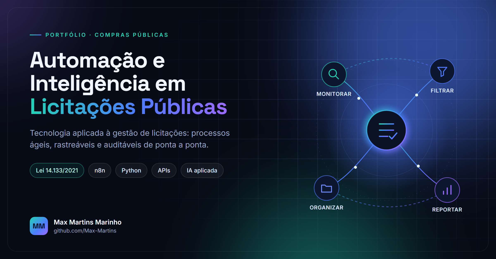
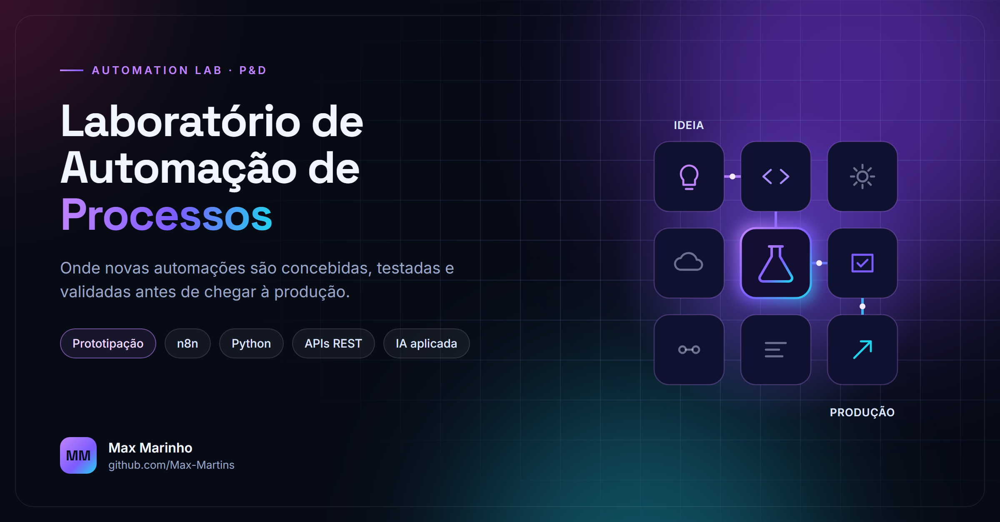
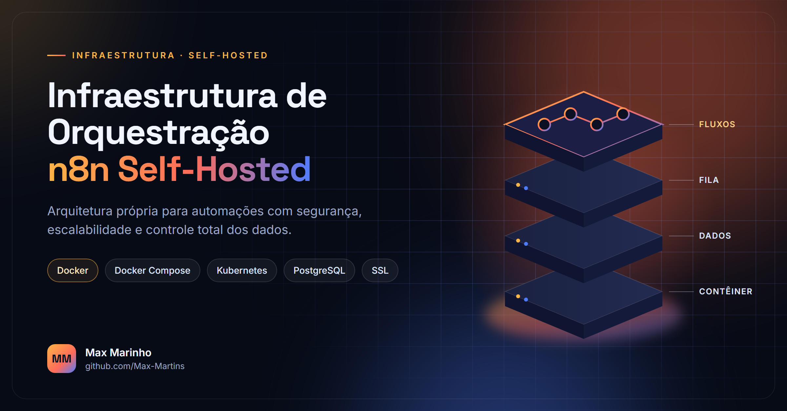
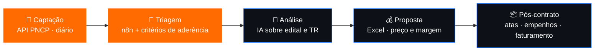

  

 

## Sobre mim

Sou **Analista de Licitação** e trabalho na interseção entre **compras públicas, tecnologia e automação**. Transformo rotinas manuais do ciclo licitatório (captação de editais, triagem, organização de documentos e relatórios) em **fluxos automatizados, auditáveis e versionados**.

- 🎯 **Foco atual:** automação da captação de pregões eletrônicos via API do PNCP
- 🛠️ **Construindo:** fluxos em n8n com código JavaScript e Python, rodando em Docker
- 🤖 **Explorando:** IA generativa (Claude Code, Codex, MCP) para análise de editais e TRs
- ⚖️ **Base normativa:** Lei nº 14.133/2021 e rotinas de pregão eletrônico

> **Menos tarefa repetitiva. Mais automação. Mais tempo para decisões que importam.**

---

## Habilidades

<table>
<tr>
<td width="50%" valign="top">

#### 📑 Licitações & Negócio

- Captação e triagem de oportunidades (PNCP)
- Análise de editais, termos de referência e riscos
- Pregão eletrônico e Lei nº 14.133/2021
- Formação de preço, margem e viabilidade
- Gestão de atas, empenhos e ordens de fornecimento
- Relatórios gerenciais em Excel

</td>
<td width="50%" valign="top">

#### ⚙️ Tecnologia & Automação

- Orquestração de fluxos com **n8n** (self-hosted)
- Integração com **APIs REST** e **GraphQL**
- Scripts em **JavaScript** e **Python**
- Containers com **Docker / Docker Compose**
- CI/CD e rotinas agendadas com **GitHub Actions**
- Desenvolvimento assistido por **IA** e **MCP**

</td>
</tr>
</table>

  

---

## Projetos

<table>
<tr>
<td width="50%" valign="top">

### 📡 Captação de Licitações · PNCP

Automação diária que monitora oportunidades de pregão eletrônico em fontes oficiais, aplica critérios proprietários de aderência ao portfólio, gera **relatórios gerenciais** e organiza a documentação dos editais.

- Execução agendada e monitorada
- Tolerância a falhas com alertas automáticos
- Processo auditável e versionado

`n8n` `JavaScript` `API PNCP` `Excel` `Docker`

🔒 Código em repositório privado · demonstração sob solicitação

</td>
<td width="50%" valign="top">

### 🧪 Automation Lab

Laboratório onde novas automações são concebidas, testadas e validadas antes de chegar à produção.

- Prototipação e testes de novos fluxos
- Componentes reutilizáveis e boas práticas
- IA aplicada ao desenvolvimento

`n8n` `Python` `APIs REST` `IA`

🔒 Repositório privado

</td>
</tr>
<tr>
<td width="50%" valign="top">

### 🐳 n8n Self-Hosting

Referência de hospedagem do n8n em diferentes ambientes (Docker, Docker Compose, Kubernetes), usada como base para a infraestrutura dos meus fluxos de automação.

`Docker` `Kubernetes` `n8n`

[**Repositório →**](https://github.com/Max-Martins/n8n-hosting)

</td>
<td width="50%" valign="top">

### 📊 Profile Cards

Gerador próprio dos painéis deste perfil. Coleta dados pela **API GraphQL do GitHub** e desenha os SVGs de métricas, sequência, atividade e conquistas, sem serviços de terceiros e sem dependências externas.

- Python puro (apenas biblioteca padrão)
- Atualização diária via GitHub Actions
- Modo `--demo` para testar o layout offline

`Python` `GraphQL` `GitHub Actions` `SVG`

[**Código →**](./scripts/generate_cards.py) · [Workflow →](./.github/workflows/metrics.yml)

 

### 🐍 Contribution Snake

Animação do gráfico de contribuições, gerada diariamente por GitHub Actions e publicada em branch dedicada.

`GitHub Actions` `SVG`

[**Workflow →**](./.github/workflows/snake.yml)

</td>
</tr>
</table>

---

## Automação no ciclo da licitação

Onde cada ferramenta entra, do edital publicado ao pós-contrato:

🟧 já automatizado &nbsp;·&nbsp; 🟦 próximos passos &nbsp;·&nbsp; Infra: Docker (n8n self-hosted) · GitHub (versionamento) · Actions (rotinas agendadas)

---

## GitHub em números

<b>🏆 Ver conquistas</b>

 

 

Painéis gerados diariamente por <a href="./scripts/generate_cards.py">generate_cards.py</a> via GitHub Actions.

---

## Vamos conversar

Quer trocar ideias sobre automação de licitações, integração com o PNCP, n8n ou IA aplicada?

 

  

